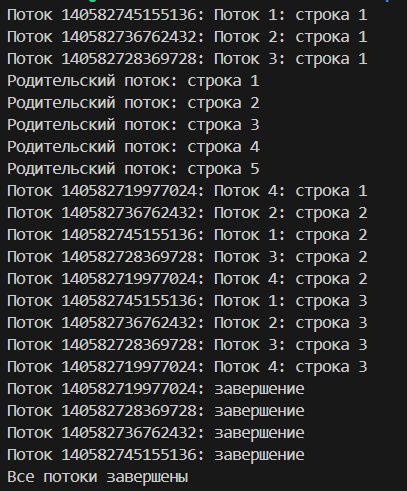
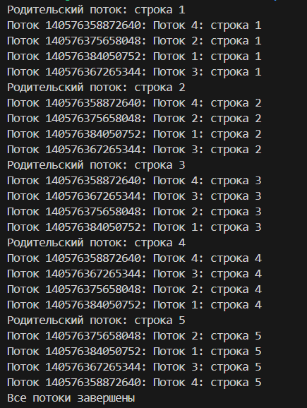
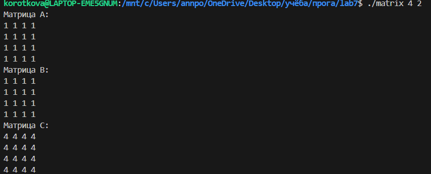
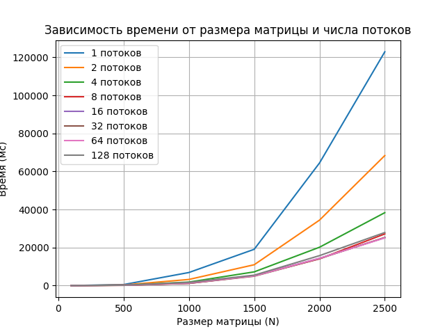
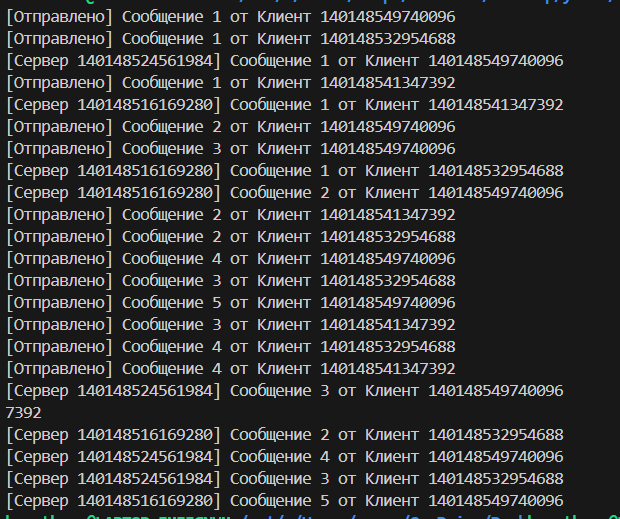

# Задание 1.
## 1.1 pthread_create()
Функция создания потока - `pthread create()`, в качестве аргументов передаются NULL/указатель на `pthread_t`, где функция может хранить индентификатор созданного потока, атрибуты нового потока, функция, с к-й будет начинать исполнение созданный поток и аргумент этой функции.
Для вывода строк функция была дописана:
## 1.2 pthread_join
Функция ожидания завершения потока - `pthread_join`. В качестве аргументов вводятся: целевой поток, чьего терминирования требуется дождаться, и указатель на переменную, где может храниться значение pthread_exit().
```c
    for (int i = 0; i < NUM_THREADS; i++){
        pthread_join(threads[i], NULL);
    }
```
## 1.3 Модификация pthread_create()
Создание потоков, которые начинают свою работу с выполенения функции распечатки строк (передано как параметр).
```c
    for (int i = 0; i < NUM_THREADS; i++){
        if (pthread_create(&threads[i], NULL, print_strings, strings[i]) != 0){
            printf("Ошибка создания потока\n");
            return 1;
        }
    }
```
## 1.4 pthread_cancel()
Функция `pthread_cancel()` запрашивает прерывание выполнения потока. В качестве аргумента принимает индентификатор потока.
```c
    for (int i = 0; i < NUM_THREADS; i++){
        pthread_cancel(threads[i]);
    }
```
## 1.5 pthread_cleanup_push()
Функция `pthread_cleanup_push()` добавляет на вершину стека вызовов обработчик прерывания потока. В качестве аргументов принимает указатель на функцию, чей вызов необходимо добавить в стек, и аргумент этой функции.

## 1.6 sleepsort
На вход подается массив. Для каждого элемента массива создается отдельный поток, в который в качестве аргумента передается значение элемента. Сам поток уходит в сон с помощью sleep() с параметром равным аргументу потока (значение элемента массива), а после выводит на экран значение.

# Задание 2
## Синхронизированный вывод и mutex
Переменная turn управляет очередностью вывода: 0 — очередь родительского потока, 1 — очередь дочерних потоков. Дочерний поток после вывода увеличивает `child_count`. Если `child_count == NUM_THREADS` (4), он сбрасывает счётчик и устанавливает `turn = 0`.

## Перемножение квадратных матриц NxN 
Матрицы A и B заполняются единицами, C вычисляется потоками.`rows_per_thread = N / num_threads` определяет, сколько строк обрабатывает каждый поток. Остаток (remaining_rows) добавляется к последнему потоку. Параметры (размер матриц, количество потоков) указываются при запуске.

## Время выполнения
Время измеряется с помощью `clock_gettime(CLOCK_MONOTONIC)`. Результаты сохраняются в results.csv в формате: N,Threads,Time(ms), затем строится график с помощью отдельного кода.

На графике видно, что для N≤500 время выполнения почти не зависит от числа потоков, так как расходы на создание потоков превышают выгоду от параллелизма. Для N≥500 параллелизм начинает давать эффект: время уменьшается с ростом числа потоков примерно до 16, для большего числа потоков изменения во времени незначительны, поскольку начинает расти конкуренция за ресурсы процессора. Оптимальное число потоков зависит от архитектуры системы, но в данном случае 64 потока показали наилучший результат для больших N.

# Задание 3
Реализует односторонний чат между клиентами и серверами с использованием очереди сообщений (FIFO). Три клиента отправляют сообщения в очередь, а два сервера принимают их. Очередь реализована как кольцевой буфер с динамической памятью, синхронизация выполняется через мьютекс и условные переменные. Клиенты и серверы работают асинхронно с случайными задержками.
1. `pthread_cond_wait`: заставляет поток ждать на условной переменной (not_full или not_empty), пока очередь не освободится или не появится сообщение.
2. `pthread_cond_signal`: сигнализирует одному потоку, ждущему на условной переменной, что очередь изменила состояние (например, стала непустой или освободилась).
